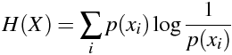
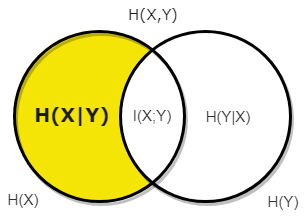
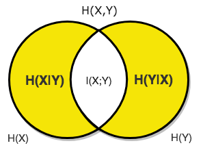

# Entropy Wiki

| **TYPE**            | **EQUATION**                                                                                     | **VENN DIAGRAM**                                                                                  |
|---------------------|--------------------------------------------------------------------------------------------------|:-------------------------------------------------------------------------------------------------:|
| [Entropy](#entropy)             |              |                                                        |
| [Cross Entropy](#cross-entropy)       |        |        |
| [Relative Entropy](#relative-entropy)       |        |        |
| [Joint Entropy](#joint-entropy)       |        |        |
| [Conditional Entropy](#conditional-entropy) |  |  |
| [Mutual Information](#mutual-information)  |   |   |
| [Independent Entropy](#independent-entropy)  |   |   |

# Entropy

Information entropy is the average rate at which information is produced by a stochastic source of data. The measure of information entropy associated with each possible data value

## What is Entropy?

Entropy is a measure of how unpredictable something is. **High Unpredictability, High Entropy.** An example of high entropy is an orinary coin, say a quarter. If you're asked to predict the next coin flip what would you choose? It's 50-50 chance of heads or tails so the best you can do is randomly guess. The situation is unpredictable so it has **High Entropy**. Now lets consider a different example and image you opened a book and, without looking, point to a random letter anywhere in the book. If you were told you would win a million dollars if you can  correctly guess the letter. What letter would you choose? Looking at the leter frequencies for English we can see that some letter are more frequent than others. Thus we have some predictability and the entopry is not as high as a situation where each letter was equally likely.

### **Relationship between Probabilities and YES/NO Questions**

We will now explain how **Unpredictability** and **Entropy.** are related, and in doing so we will learn a relationship between the **Probability* of a random variable, ***X*** in state ***x***, occurring and the number of **YES/NO Questions** it would take to figure out what what state ***X*** is in.

<table class="tg">
  <tr>
    <th class="tg-c3ow"><b>Example 1</b></th>
    <th class="tg-c3ow"><b>Example 2</b></th>
  </tr>
  <tr>
    <td class="tg-0pky">In Example 1 Alice selects a random letter A, B, C, or D. Each with a 1/4 chance of being selected. If Bob had to guess which letter Alice chose with YES/NO questions, how many questions on average would you expect Bob to ask?</td>
    <td class="tg-0pky">In Example 2 Alice again selects a random letter, but this time the probabilities of each letter has changed to: A = 1/2, B = 1/4, C = 1/8 and D = 1/8. If Bob had to guess which letter Alice chose with YES/NO questions, how many questions on average would you expect Bob to ask?</td>
  </tr>
  <tr>
    <td class="tg-c3ow" align="center"></td>
    <td class="tg-c3ow" align="center"></td>
  </tr>
  <tr>
    <td class="tg-0pky">In example 1 Alice randomly selects a letter, where A, B, C, and D are all selected 25% of the time. If Bob has to guess with YES/NO question, How many questions on average would you expect Bob to have to ask?</td>
    <td class="tg-0pky">In example 1 Alice randomly selects a letter, where A, B, C, and D are all selected 25% of the time. If Bob has to guess with YES/NO question, How many questions on average would you expect Bob to have to ask?</td>
  </tr>
  <tr>
    <td class="tg-0pky" align="center"></td>
    <td class="tg-0pky" align="center"></td>
  </tr>
  <tr>
    <td class="tg-0pky">In example 1 Alice randomly selects a letter, where A, B, C, and D are all selected 25% of the time. If Bob has to guess with YES/NO question, How many questions on average would you expect Bob to have to ask?</td>
    <td class="tg-0pky">In example 1 Alice randomly selects a letter, where A, B, C, and D are all selected 25% of the time. If Bob has to guess with YES/NO question, How many questions on average would you expect Bob to have to ask?</td>
  </tr>
  <tr>
    <td class="tg-0pky" align="center"></td>
    <td class="tg-0pky" align="center"></td>
  </tr>
</table>

|                                                                                                            **Example 1**                                                                                                           	|                                                                                                                                      **Example 2**                                                                                                                                     	|
|:----------------------------------------------------------------------------------------------------------------------------------------------------------------------------------------------------------------------------------:	|:--------------------------------------------------------------------------------------------------------------------------------------------------------------------------------------------------------------------------------------------------------------------------------------:	|
| In Example 1 Alice selects a random letter A, B, C, or D. Each with a 1/4 chance of being selected. If Bob had to guess which letter Alice chose with YES/NO questions, how many questions on average would you expect Bob to ask? 	| In Example 2 Alice again selects a random letter, but this time the probabilities of each letter has changed to: A = 1/2, B = 1/4, C = 1/8 and D = 1/8. If Bob had to guess which letter Alice chose with YES/NO questions, how many questions on average would you expect Bob to ask? 	|
|                                                                                                                                                                                	|                                                                                                                                                                                                                                    	|
| In example 1 Alice randomly selects a letter, where A, B, C, and D are all selected 25% of the time. If Bob has to guess with YES/NO question, How many questions on average would you expect Bob to have to ask?                  	| In example 1 Alice randomly selects a letter, where A, B, C, and D are all selected 25% of the time. If Bob has to guess with YES/NO question, How many questions on average would you expect Bob to have to ask?                                                                      	|
|                                                                                                                                                                                 	|                                                                                                                                                                                                                                     	|
| In example 1 Alice randomly selects a letter, where A, B, C, and D are all selected 25% of the time. If Bob has to guess with YES/NO question, How many questions on average would you expect Bob to have to ask?                  	| In example 1 Alice randomly selects a letter, where A, B, C, and D are all selected 25% of the time. If Bob has to guess with YES/NO question, How many questions on average would you expect Bob to have to ask?                                                                      	|
|                                                                                                                                                                          	|                                                                                                                                                                                                                                	|

# Entropy Equation

 
# Cross Entropy

In information theory, the cross entropy between two probability distributions *p* and *q* over the same underlying set of events measures the average number of bits needed to identify an event drawn from the set, if a coding scheme is used that is optimized for an "artificial" probability distribution *q*, rather than the "true" distribution *p*.

# Relative Entropy 
### ***(Kullback-Liebler Divergence)***

In mathematical statistics, the Kullback–Leibler divergence (also called relative entropy) is a measure of how one probability distribution is different from a second, reference probability distribution.

# Joint Entropy

In information theory, joint entropy is a measure of the uncertainty associated with a set of variables.

# Conditional Entropy

n information theory, the conditional entropy (or equivocation) quantifies the amount of information needed to describe the outcome of a random variable *y* given that the value of another random variable *x* is known.

# Mutual Information

In probability theory and information theory, the mutual information (MI) of two random variables is a measure of the mutual dependence between the two variables.

# Independent Entropy

In probability theory and information theory, the mutual information (MI) of two random variables is a measure of the mutual dependence between the two variables.

